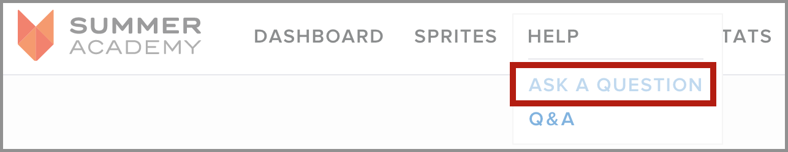
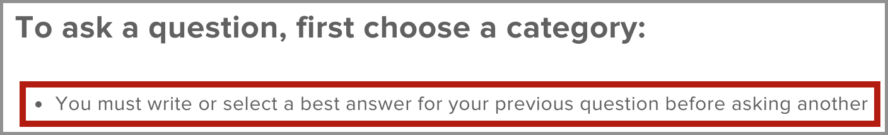
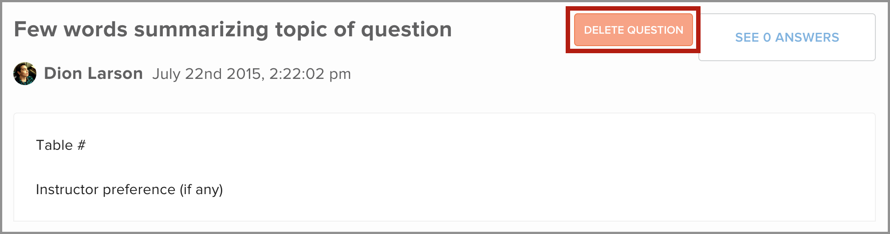

Questions should be asked through the help queue so that instructors can fairly provide help.

#Asking a question

Click `Ask a question` under `Help` to ask a new question.

You should see a popup similar to below.

Fill it out as follows:

- *Title* should be a short summary of your question topic (a few words).
- (Apps track only) Start your title with `QUICK - ` to enter the quick help queue
- *Question* should contain your table number and instructor preference if you have one. Keep in mind that requesting a specific instructor will increase your wait time! Instructors will work through the queue and answer every question in front of you. *You'll be helped once you are first in line and your requested instructor is free*. You cannot request an instructor on the quick help queue.

Your place in the help queue is the number in parenthesis next to the help button.

#After a question is answered

After your question is answered, you'll have to delete it before you can ask another. You'll know you have an unresolved question if you see this when trying to ask a new question:

To delete your question, click `Q&A` under `Help`.

Your unresolved question should be at the top. Find it and click the delete button.

